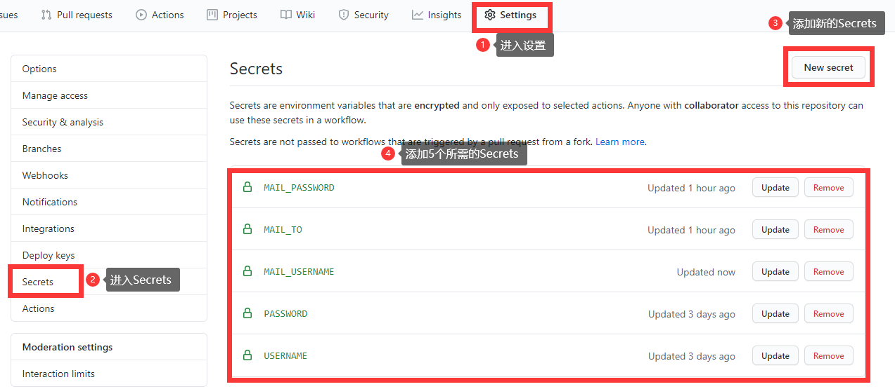
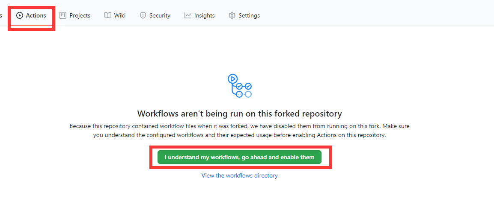

# Arctime 自动登录+签到获取积分 定时任务

#### 项目介绍

做字幕神器[**Arctime**](http://m.arctime.cn/home/user/login.html)（懂的都懂），一般来讲是免费使用的，如需购买如面向非编软件的软字幕输出、专业视频格式压制输出、**全自动语音转写**等增值性功能，则需使用积分来购买，积分需要进行 RMB 充值方可获取，换算标准为 1 元 = 100 积分。咱做视频教程的，最常用到的就是全自动语音转写功能啦，为了更好的（bai）给大家出课程（piao），我发现登录个人中心之后，每天可以进行签到！签到即可每日获取 20 积分，相当于 0.2 元 RMB 呀。而大致换算的话，10 分钟的视频撰写费用是 300 积分，也就是说，我只要连续签到 15 天即可免字幕制作费给大家做一课 10 分钟的视频啦！~**严正声明，本项目仅供研究学习使用，切勿用于非法用途或者破坏官方规则谋取利益等**

于是我研究了一个 python 小脚本用来自动登录和签到。

最开始的时候我是放在我写的定时任务框架`xjobs`：

Gitee：[https://gitee.com/xueshanlinghu/xjobs](https://gitee.com/xueshanlinghu/xjobs)

Github：[https://github.com/xueshanlinghu/xjobs](https://github.com/xueshanlinghu/xjobs)

中来运行，xjobs 托管在服务器中。

最近研究的时候发现 Github 有 Github Actions 功能，它可以提供一系列的链式方式执行线上自动化持续部署（CI/CD），还能支持定时任务，于是我就研究了一下各类文档，将本项目改造成一个依托于 Github Actions 功能的自动化每日定时任务项目，这样连服务器都省啦，而且也有日志方便查询。

那么如果你也想拥有这样的自动化功能，要怎么复用呢？


#### 手动调用（仅供测试脚本是否还能用使用，定时任务不推荐）

使用 python3.8.2 开发，请提前安装好对应的 python，建议 python3.6+ 环境。

1. 安装依赖：

```powershell
pip install -r requirements.txt
```

2. 调用脚本：

主脚本为：`arctime_auto_sign.py`

传入的第一个参数为用户名，第二个参数为密码，运行即可自动登录并签到。

如：

```powershell
python arctime_auto_sign.py 13000000000 pass123456
```


#### Github Actions 定时任务（目前极度推荐！！！）

本地无需安装环境！！！

请提前准备好 Arctime 的**用户名**和**密码**。

享用方式：

1. Fork 本项目到你自己的仓库库。

2. 点击 Settings → Secrets，创建六个 Secrets。（别担心，放进去并保存后连你自己都无法再看到明文，只允许更新或删除，不会公开的）必须要设置哦，否则脚本会运行失败！如图所示：

   

   它们分别为：

   | Name | Value |
   | :----: | :----: |
   | USERNAME | arctime 用户名 |
   | PASSWORD | arctime 密码 |
   | MAIL_USERNAME | MAIL_USERNAME |
   | MAIL_PASSWORD | qq 邮箱授权码（不懂怎么获取的可以问我） |
   | MAIL_TO | 收件邮箱 |
   | MAIL_SMTP_SERVER | SMTP 服务器地址 |

3. 点击 Actions，当项目 Fork 之后，为了避免风险，项目都会自动关闭 Actions 的开启，所以我们需要手动开始，点击按钮`I understand my workflows, go ahead and enable them`即可启用定义好的执行代码。到点了会自动进行执行。如图所示：

   

4. 自定义任务：定时任务配置已经写好了，存放在`.github/workflow/auto_sign.yaml`文件中。目前默认会自动运行脚本的触发条件有两个，第一是当 push 项目的时候，第二是定时每天早上约 8 点 30 分（北京时间）的时候（线上因为定时任务排队可能会有半小时左右的延期，定时并不一定是完全精准的）。如需个性定制化 Github Actions 或修改定时任务时间，请打开该文件，修改定时任务的时间，可以修改 `cron` 的值，该值目前定义的时间为每天的 0 点 30 分（UTC 时间），目前发现该表达式仅支持 UTC 时间（格林威治时间），北京时间为东八区，如果以北京时间为准就是该时间加上 8 个小时。设定的时候需要注意一下。其他的内容如果你知道如何设定，可以按照你自己的需要进行设定。如果不知道就不要动了。【温馨提示：实测如果你是免费版 Github Actions，定时执行的时间可能会不准，我遇到过比定时迟了二十到三十分钟执行的情况】

   如果你不知道如何设定自己需要的 cron 时间表达式，可以到这个网站看看：[https://crontab.guru/](https://crontab.guru/)

当自动执行完毕后，可以到 Actions 下查看运行的日志。成功打勾，失败打叉。然后你也可以到 arctime 官网上验证一下是否签到成功了。

尽情享用吧！


#### 关于项目贡献

本项目完全开源，大家可以各取所需。

如果你有自己的**想法**、**建议**、**bug问题**等，欢迎在 Gitee 或者 Github 提`Issue`。

如有其它代码贡献，欢迎提`Pull requests`。

Gitee 推出了类似的服务 Gitee Go，但目前仅提供给企业用户内测使用。添加执行时间似乎还要交钱，所以还是先用着 Github 的免费服务吧。


#### 更新日志
v1.3 20201203:
1. 将发送邮件的 server 修改为自定义的，可以根据需要进行配置。
2. 针对 markdown 写作规范修改文件排版。


v1.2 20201028:

1. 进行定时任务时间调试等，修改对应的 README 文件。


v1.1 20201023：

1. 添加发送日志邮件的功能


v1.0 20201021：

1. 完成项目整体布局开发，自动部署改造，编写完成详细的说明文档。摸摸哒~


